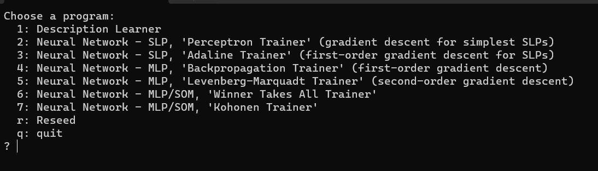
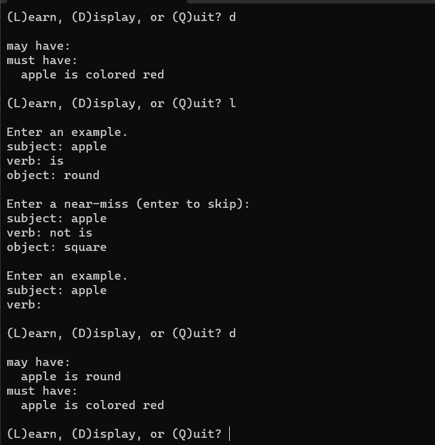
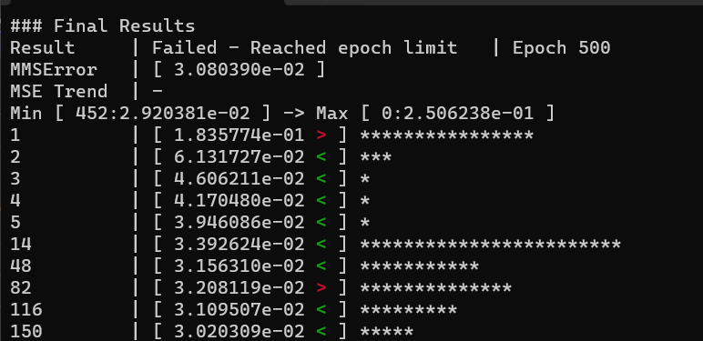
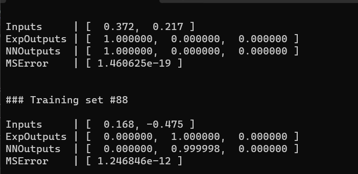

## Machine learning examples
### List of programs

### Description Learner:
 an ‘object description learner’ which implements a basic version of an expert system.

### Neural Network:
a neural-network-building framework using C++ templates and interface classes, exploring the mathematical side of neural networks by implementing supervised and unsupervised training methods.

